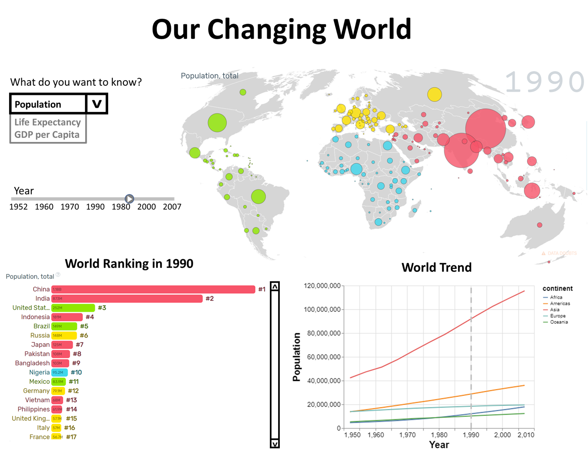

# Our Changing World!

## About

The world that we live in has dramatically changed over the past several decades. This dashboard was created with the objective of making such pertinent fact-based data available to the world in a comprehensible format using customizable visualization of global development statistics using data from Gapminder Foundation: gapminder. The goal is to help governments, international organizations, researchers, and policymakers draw evidence-based conclusions about the state of the world as a first step towards addressing global challenges outlined in the SDGs. The proposal of this project could be found [here](https://github.com/UBC-MDS/our_changing_world/blob/main/proposal.md).

## Contributors

-   Vera Cui
-   John Lee
-   Rakesh Pandey
-   Nagraj Rao

## Description of "Our Changing World" App

The app consists of 4 main sections: "control" panel at the upper left section, and 3 plot sections. 

In the "control" section, one can choose the subject in which he/she is interested from the choice of Population, Life Expectancy, and GDP per Capita. One can also specify the year by using the scroll bar.  

The app shows 3 different types of plots: (1) world map with data for each countries (upper right section), (2) bar chart showing the world ranking (lower left section), and (3) time-series plot for each continent. All these plots are automatically updated when new inputs are entered in the "control" section.  

## Running locally

To run a development instance locally, create a virtualenv, install the requirements from `requirements.txt` and launch `app.py` using the Python executable from the virtualenv.

## Deploying on Heroku

Use `make image` to create a Docker image. Then, follow [these
instructions](link_to_url) to deploy the image on Heroku.
